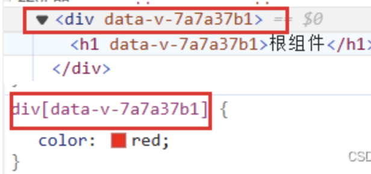

## vue中的样式穿透
### scoped样式隔离
一个style标签拥有scoped属性时，css样式就只能作用于当前组件，这样就可以使得组件之间的样式不会相互污染。如果一个项目中的所有style标签全部加上了scoped，相当于实现了组件的私有化，样式的模块化。 
### 原理
scope的原理是相当于给html标签和css选择器添加data-v-xxx来达到样式隔离的效果。 
1. 选中的标签中添加属性data-v-hash
2. 样式选择器后面追加data-v-hash的属性选择器

### 样式穿透后的问题
使用scoped后，父组件无法修复子组件中的样式（除了子组件根节点）
+ 父组件的样式将不会渗透到自组件中
+ 父组件可以修改子组件根节点的样式
>如果父组件和子组件同时设置子组件根节点的样式，父组件样式的优先级高一点。

